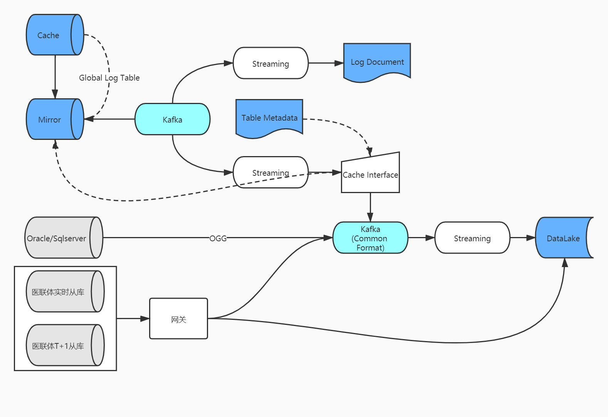

data-pipeline
===========
## 介绍
    抓取数据库的变更日志并发送到kafka集群。
    
    
##项目部署
### 1 应用打包

```shell script
mvn clean install -DskipTests
```
### 2 配置流程
1、配置[data-capture](data-capture/README.md)，抓取Caché和Mongo数据库的数据变更日志，
   Caché日志变更发送到第一层kafka，Mongo日志变更发送到第二层kafka。
   
2、配置[data-transform](data-transform/README.md)，备份第一层kafka的Caché日志到HDFS，同时将第一层Caché日志
   转换为完整记录发送到第二层kafka。
    